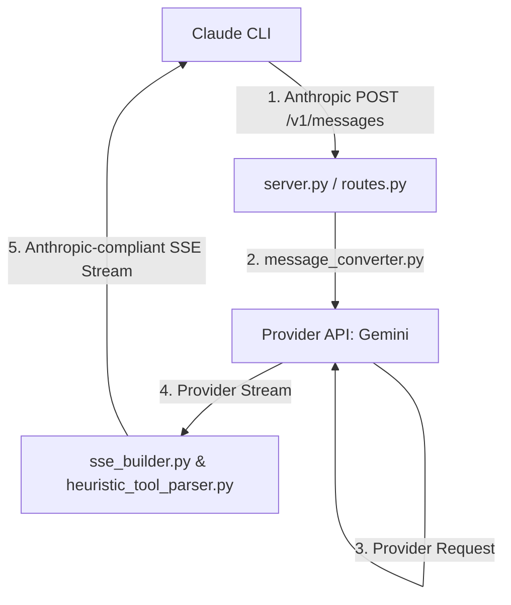

# Free Claude Code Gemini Bridge

A high performance bridge for running Claude Code using Gemini powered backends. This project provides a lean and lightweight pipeline optimized specifically for Google Gemini models.

## Project Status
The bridge is fully functional. It acts as a bridge for running Claude Code using Gemini powered backends. All redundant providers and legacy modules have been removed to ensure maximum performance and minimal latency.

## Architecture

The following diagram illustrates how the pipeline intercepts Anthropic requests, translates them for Gemini, and streams the compliant response back to the Claude CLI.

### Data Flow Explanation
1. Request Interception: The Claude Code CLI sends an Anthropic-formatted POST request to the local server.
2. Schema Translation: The bridge maps Anthropic roles, instructions, and tool schemas into the standard Gemini format.
3. Provider Execution: The translated payload is dispatched to the configured Gemini API.
4. Streaming Translation: As the provider streams tokens, the bridge wraps them into the exact SSE format that the Anthropic CLI expects.
5. Tool Parsing: A heuristic parser extracts tool calls from the stream in real time to maintain interactivity.
6. Return Stream: The server returns a real-time SSE stream back to the Claude CLI.

## Setup
1. Configure your environment variables in the .env file.
2. Install dependencies using uv.
3. Start the server using the command python server.py.

## Usage
Once the server is running on localhost port 8082, point your Claude Code CLI to the local bridge:
export ANTHROPIC_BASE_URL=http://localhost:8082/v1
export ANTHROPIC_API_KEY=your_token
claude

## License
MIT
